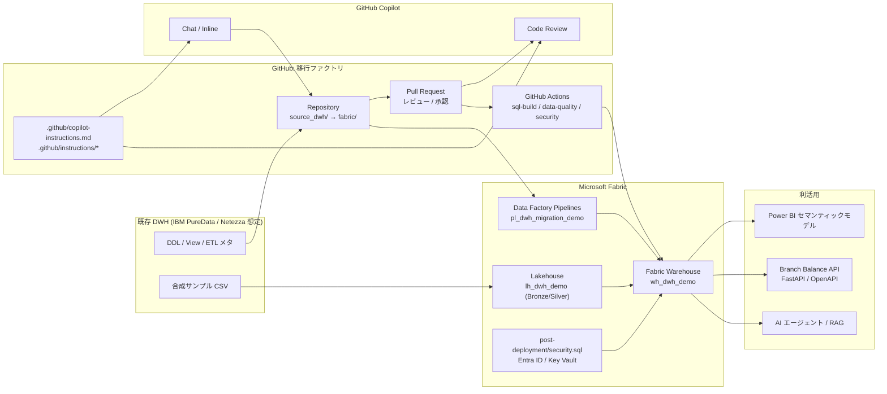

# アーキテクチャ（1 枚版）

本図は、デモのオープニング 3 分で見せる「現行 DWH → GitHub 移行ファクトリ → Microsoft Fabric → Power BI / API / AI エージェント」の関係を 1 画面に集約したものである。`docs/demo_script.md` のシーン 0 でそのまま投影する。

## 図解の意図

- **Git が中心**: 既存 DWH 資材は `source_dwh/`、Fabric 向け変換物は `fabric/` に置く。差分・履歴・承認・テスト結果がすべて GitHub に集まる。
- **Copilot は相棒**: Chat と Code Review が、`.github/copilot-instructions.md` と `.github/instructions/*` の指示に従って一貫した出力を出す。最終判断は人間。
- **CI が安全網**: `sql-build` / `data-quality-check` / `security-scan` が、merge 前に方言差分・テスト不足・シークレット混入を検出する。
- **Fabric が反映先**: Warehouse / Lakehouse / Pipeline / Security が Git の成果物そのものから組み立てられる。
- **業務価値は下流**: Power BI、API、AI が curated データに乗る。本デモはその「土台」を見せる位置づけ。

## 1 段抽象を上げた説明（経営向け）

> 既存 DWH の Fabric 統合を、属人作業から **Git で管理される標準作業** に変える。Copilot で初期ドラフトを高速化し、Pull Request と CI で品質を担保し、Fabric Warehouse へ安全に反映する。Power BI と API/AI 連携は、その上に乗る業務価値である。

## 関連ファイル

- `docs/demo_script.md`: 各シーンの読み合わせ用台本
- `docs/sql_dialect_mapping.md`: Netezza → Fabric T-SQL の方言マッピング
- `docs/copilot_prompt_cards.md`: Copilot 実演用プロンプトカード
- `fabric/lakehouse/bronze_to_silver_mapping.md`: Bronze → Silver の列マッピング
